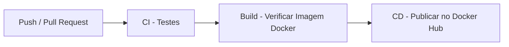

# ☕ Aroma & Grão — Cafeteria API

Projeto integrador da disciplina **Gerenciamento de Configuração de Software** do curso de Análise e Desenvolvimento de Sistemas (ADS) — IFPE.

## 👥 Equipe

| Nome |
|------|
| Joseildo |
| Eduardo |
| Eliabe |
| Erik |
| Luiz Felipe |

---

## 📌 Descrição do Projeto

Este projeto implementa uma **API REST** para gerenciamento de produtos de uma cafeteria fictícia chamada **Aroma & Grão**, com um pipeline CI/CD completo utilizando **GitHub Actions** e **Docker**.

---

## 🛠️ Tecnologias Utilizadas

- Python 3.12
- FastAPI
- Pytest
- Docker
- GitHub Actions
- Docker Hub

---

## 🔁 Fluxo do Pipeline CI/CD



### Descrição dos Jobs

| Job | Gatilho | O que faz |
|-----|---------|-----------|
| CI - Testes | Todo push e pull request | Instala dependências e executa os testes automatizados com pytest |
| Build | Após CI passar | Constrói a imagem Docker para validar o Dockerfile |
| CD | Push na branch master | Publica a imagem no Docker Hub |

---

## 🚀 Como executar localmente com Docker

### Pré-requisitos
- Docker instalado

### Passos

```bash
# Clone o repositório
git clone https://github.com/joseildo-ixel/Site_cafeteria.git
cd Site_cafeteria

# Suba a aplicação
docker compose up
```

A API ficará disponível em: `http://localhost:8000`

Documentação interativa: `http://localhost:8000/docs`

---

## 🧪 Como executar os testes

```bash
# Instale as dependências
pip install -r api/requirements.txt

# Execute os testes
python -m pytest api/testes/ -v
```

---

## 📡 Endpoints da API

| Método | Rota | Descrição |
|--------|------|-----------|
| GET | `/health` | Verificação de saúde da API |
| POST | `/produtos` | Criar um produto |
| GET | `/produtos/{id}` | Buscar um produto por ID |
| PUT | `/produtos/{id}` | Atualizar um produto |
| DELETE | `/produtos/{id}` | Remover um produto |

---

## 🐳 Imagem Docker

A imagem é publicada automaticamente no Docker Hub a cada push na branch `master`:

```bash
docker pull joseildosystem/cafeteria-api:latest
```

---

## 📸 Evidências de Execução

> Adicione aqui prints do GitHub Actions com todos os jobs em verde.

---

## 🌱 Estratégia de Branches (GitFlow)

| Branch | Finalidade |
|--------|-----------|
| `master` | Versão estável e final |
| `develop` | Integração das funcionalidades |
| `feature/*` | Novas funcionalidades |
| `release/*` | Preparação para lançamento |
|
