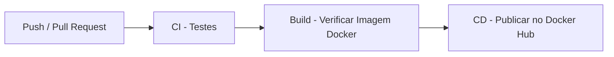

# Aroma & Grao - Cafeteria API

Projeto integrador da disciplina **Gerenciamento de Configuração de Software** do curso de Analise e Desenvolvimento de Sistemas (ADS) - IFPE.

## Equipe

| Nome |
|------|
| Joseildo dos Santos|
| Eduardo Arthur|
| Eliabe Rafael|
| Erik Jerônimo|
| Luis Felipe |
| Romero Galindo |
| Augusto Marcolino |

---

## Descrição do Projeto

Este projeto implementa uma **API REST** para gerenciamento de produtos de uma cafeteria ficticia chamada **Aroma & Grao**, com um pipeline CI/CD completo utilizando **GitHub Actions** e **Docker**.

---

## Tecnologias Utilizadas

- Python 3.10
- FastAPI
- Pytest (com pytest-html)
- Docker
- GitHub Actions
- Docker Hub

---

## Fluxo do Pipeline CI/CD



### Descrição dos Jobs

| Job | Gatilho | O que faz |
|-----|---------|-----------|
| CI - Testes | Todo push e pull request | Instala dependencias, executa os testes automatizados e gera relatório de resultados em HTML |
| Build | Apos CI passar | Constroi a imagem Docker localmente para validar o Dockerfile |
| CD | Push na branch master | Publica a imagem no Docker Hub com tags de versão e latest |

---

## Como executar localmente com Docker

### Pre-requisitos

- Docker instalado

### Passos

```bash
# Clone o repositorio
git clone [https://github.com/joseildo-ixel/Site_cafeteria.git](https://github.com/joseildo-ixel/Site_cafeteria.git)
cd Site_cafeteria

# Construa a imagem e suba a aplicacao localmente
docker compose up --build
```

A API ficara disponivel em: `http://localhost:8000`

Documentacao interativa: `http://localhost:8000/docs`

---

## Como executar os testes

```bash
# Instale as dependencias
pip install -r api/requirements.txt
pip install pytest pytest-html

# Execute os testes
python -m pytest api/testes/ -v
```

---

## Endpoints da API

| Metodo | Rota | Descricao |
|--------|------|-----------|
| GET | `/health` | Verificacao de saude da API |
| GET | `/produtos` | Listar todos os produtos |
| POST | `/produtos` | Criar um produto |
| GET | `/produtos/{id}` | Buscar um produto por ID |
| PUT | `/produtos/{id}` | Atualizar um produto |
| DELETE | `/produtos/{id}` | Remover um produto |

---

## Imagem Docker

A imagem e publicada automaticamente no Docker Hub a cada push na branch `master` (ou `main`):

```bash
docker pull joseildosystem/cafeteria-api:latest
```

---

## Evidencias de Execucao


*(Nota: Certifique-se de atualizar o arquivo docs/pipeline.png com um print da nova pipeline passando verde no GitHub Actions!)*

---

## Estrategia de Branches (GitFlow)

| Branch | Finalidade |
|--------|-----------|
| `master` | Versao estavel e final |
| `develop` | Integracao das funcionalidades |
| `feature/*` | Novas funcionalidades |
| `release/*` | Preparacao para lancamento |
from fastapi import FastAPI, HTTPException
from pydantic import BaseModel
from typing import List

# Criando a API
app = FastAPI()

# Modelo do Produto
class Produto(BaseModel):
    id: int
    nome: str
    preco: float

# Banco de dados em memória
banco_produtos: List[Produto] = []

# Rota de saúde
@app.get("/health")
def health():
    return {"status": "API rodando"}

# Listar produtos
@app.get("/produtos", response_model=List[Produto])
def listar_produtos():
    return banco_produtos

# Criar produto
@app.post("/produtos")
def criar_produto(produto: Produto):
    banco_produtos.append(produto)
    return produto

# Buscar produto por ID
@app.get("/produtos/{id}")
def buscar_produto(id: int):
    for produto in banco_produtos:
        if produto.id == id:
            return produto
    raise HTTPException(status_code=404, detail="Produto não encontrado")

# Atualizar produto
@app.put("/produtos/{id}")
def atualizar_produto(id: int, novo_produto: Produto):
    for index, produto in enumerate(banco_produtos):
        if produto.id == id:
            banco_produtos[index] = novo_produto
            return novo_produto
    raise HTTPException(status_code=404, detail="Produto não encontrado")

# Deletar produto
@app.delete("/produtos/{id}")
def deletar_produto(id: int):
    for index, produto in enumerate(banco_produtos):
        if produto.id == id:
            del banco_produtos[index]
            return {"mensagem": "Produto removido"}
    raise HTTPException(status_code=404, detail="Produto não encontrado")
